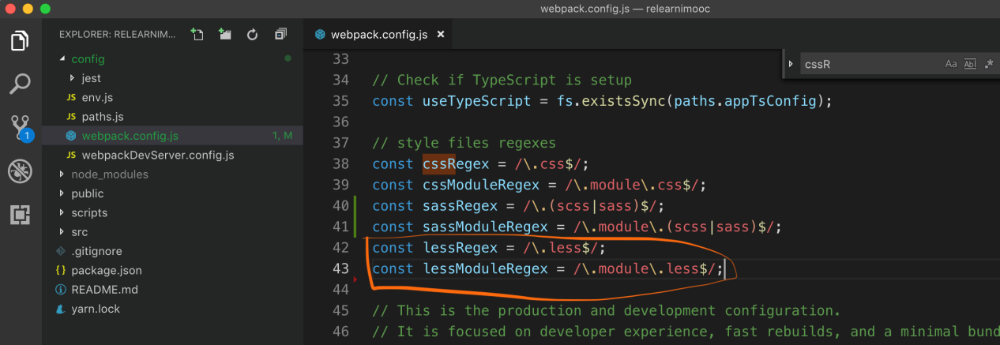
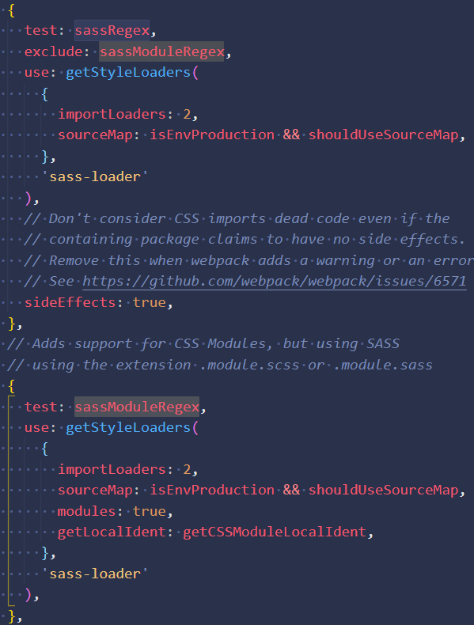
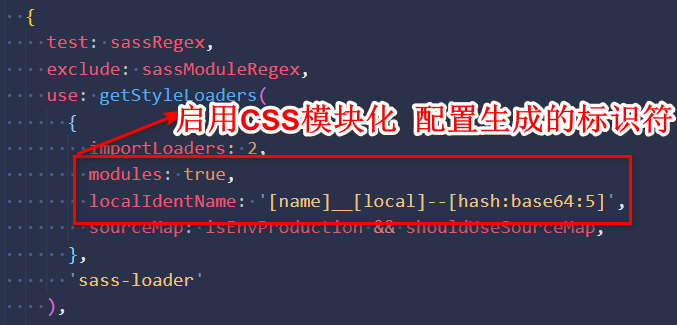

# create-react-app 中添加less文件 配置文件

## 前置知识：

    把 webpack 的相关配置暴露出来
    1.	运行 git add -A
    2.	运行 git commit -m 'project init'
    3.	运行 yarn eject 然后选 y
    4.	项目中多出来两个文件夹 config 和 scripts

## 在 config 文件夹中找到 webpack.config.js 文件如下图：

## 在 webpack.config.js 中书写如下配置：

## 把 sass 的配置复制一份， 把名字改成上一步书写的 less 配置，把 sass-loader 改成 less-loader，其余相同。

## 安装 less 和 less-loader 包即可(切记两个都需要安装）

# CSS Modules 模块化

