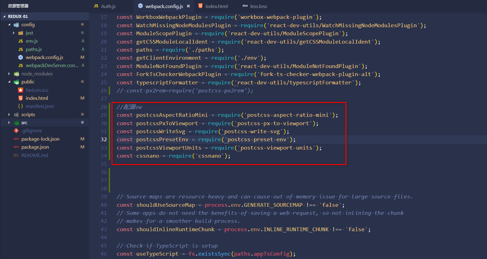
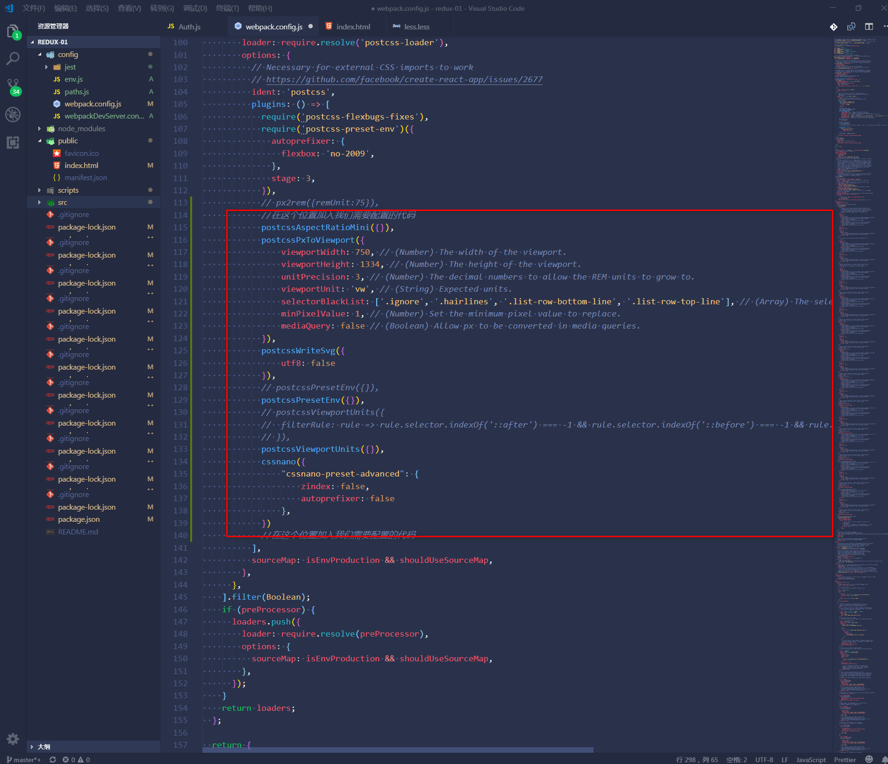
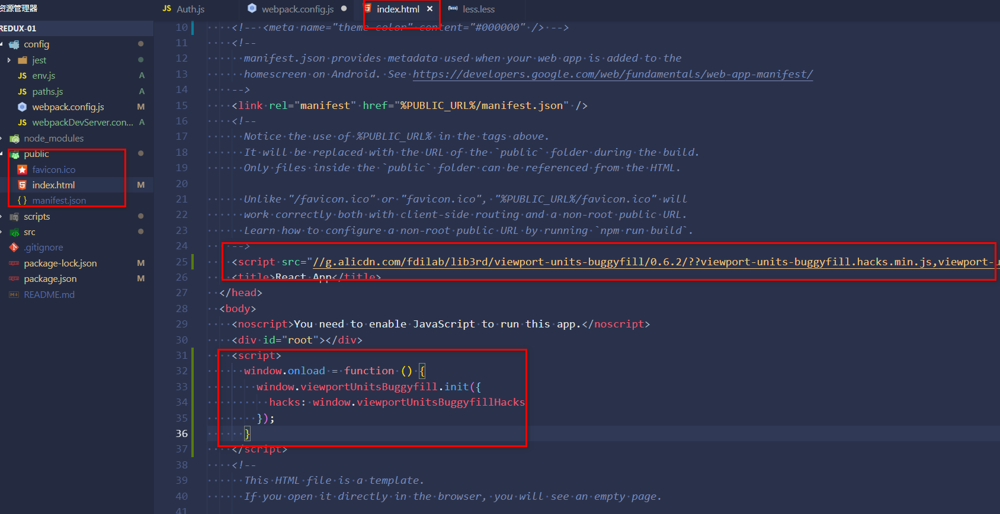
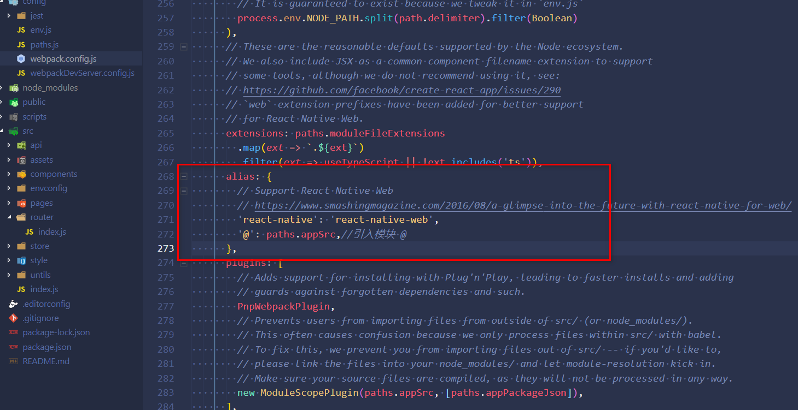

# react 上配置使用vw vh移动端适配方案

## 第一步 安装插件

    npm install --save postcss-aspect-ratio-mini postcss-px-to-viewport postcss-write-svg postcss-viewport-units cssnano postcss-preset-env

## 第二步 引入postCss插件

    ```
    const postcssAspectRatioMini = require('postcss-aspect-ratio-mini');
    const postcssPxToViewport = require('postcss-px-to-viewport');
    const postcssWriteSvg = require('postcss-write-svg');
    const postcssPresetEnv = require('postcss-preset-env');
    const postcssViewportUnits = require('postcss-viewport-units');
    const cssnano = require('cssnano');

    ```



## 第三步 增加postcss 配置

    ```
    options: {
          // Necessary for external CSS imports to work
          // https://github.com/facebook/create-react-app/issues/2677
          ident: 'postcss',
          plugins: () => [
            require('postcss-flexbugs-fixes'),
            require('postcss-preset-env')({
              autoprefixer: {
                flexbox: 'no-2009',
              },
              stage: 3,
            }),
            // px2rem({remUnit:75}),

            //在这个位置加入我们需要配置的代码
            postcssAspectRatioMini({}),

            postcssPxToViewport({
                viewportWidth: 750, // (Number) The width of the viewport.
                viewportHeight: 1334, // (Number) The height of the viewport.
                unitPrecision: 3, // (Number) The decimal numbers to allow the REM units to grow to.
                viewportUnit: 'vw', // (String) Expected units.
                selectorBlackList: ['.ignore', '.hairlines', '.list-row-bottom-line', '.list-row-top-line'], // (Array) The selectors to ignore and leave as px.
                minPixelValue: 1, // (Number) Set the minimum pixel value to replace.
                mediaQuery: false // (Boolean) Allow px to be converted in media queries.
            }),

            postcssWriteSvg({
                utf8: false
            }),

            // postcssPresetEnv({}),
            postcssPresetEnv({}),

            // postcssViewportUnits({
            //  filterRule: rule => rule.selector.indexOf('::after') === -1 && rule.selector.indexOf('::before') === -1 && rule.selector.indexOf(':after') === -1 && rule.selector.indexOf(':before') === -1
            // }),

            postcssViewportUnits({}),

            cssnano({
                "cssnano-preset-advanced": {
                    zindex: false,
                    autoprefixer: false
                },
            })

            //在这个位置加入我们需要配置的代码
          ],
          sourceMap: isEnvProduction && shouldUseSourceMap,
    },
    
    ```


## 第四步 配置成功

    npm start

## 第五步 兼容我们android 低版本的机型hack 加入viewport-units-buggyfill配置

    打开public/index.html，在head 中插入 viewport-units-buggyfill 和body 中使用

    ```
    <head>
        <script src="//g.alicdn.com/fdilab/lib3rd/viewport-units-buggyfill/0.6.2/??viewport-units-buggyfill.hacks.min.js,viewport-units-buggyfill.min.js"></script>
    </head>

    <body>
        <script>
            window.onload = function () {
                window.viewportUnitsBuggyfill.init({
                hacks: window.viewportUnitsBuggyfillHacks
                });
            }
        </script>
    <body>

```



## 第六步 导入文件@
    在webpack.config.js中
    
```
alias: {
    // Support React Native Web
    // https://www.smashingmagazine.com/2016/08/a-glimpse-into-the-future-with-react-native-for-web/
    'react-native': 'react-native-web',
    '@': paths.appSrc,//引入模块 @
},

```


